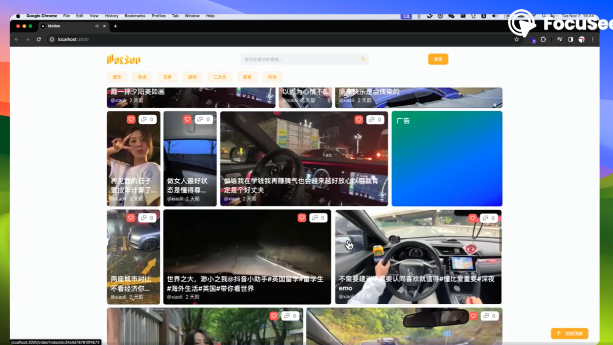
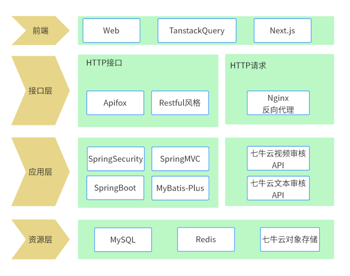
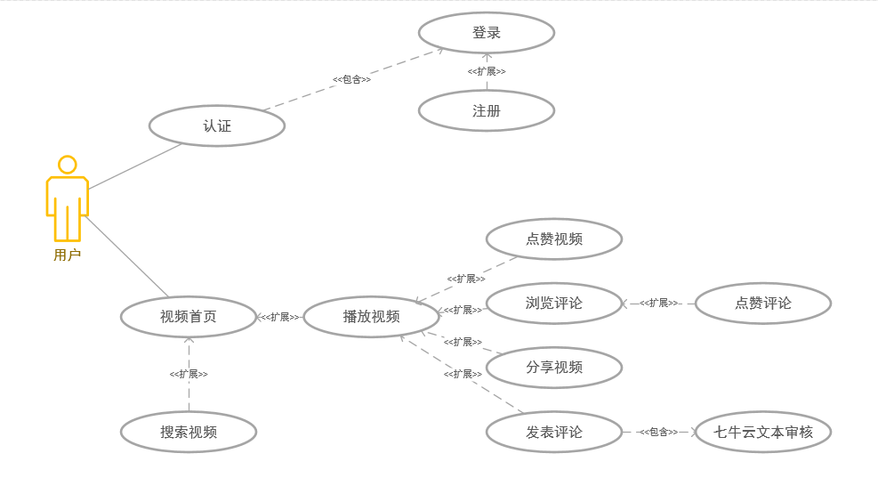
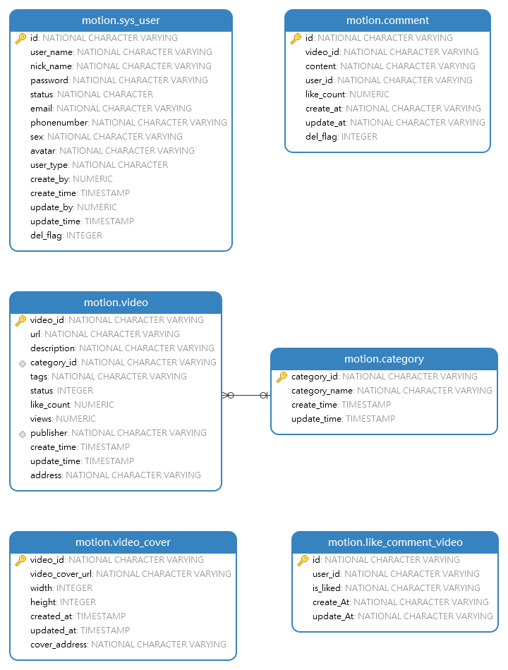
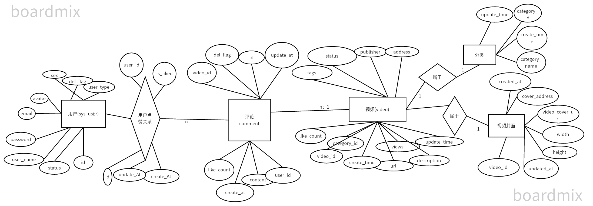
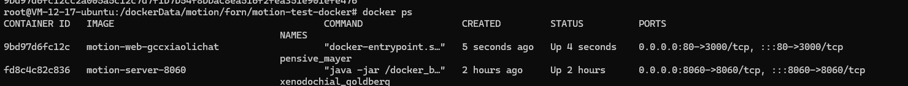

# Motion 短视频 web后端
## 简述
随着互联网的发展，手机和电脑越来越普及，短视频已经成为了人们生活中不可或缺的一部分，人们喜欢通过短视频分享自己的生活有趣的瞬间，以及对视频进行评论和分享，短视频网站越来越被人们所喜欢，短视频网站的需求越来越大，因此开发短视频网站是大势所趋。

### 演示
 [点击查看演示视频](https://nanfangshaonian.feishu.cn/file/VTfDbgp2goPulgxvIF0c31eUnnb)

[点击在线体验](http://GCC.xiaoli.chat)

**程序获的"七牛云第二届校园编程马拉松"创作奖** 
- 活动地址:https://www.qiniu.com/activity/detail/651297ed0d50912d3d53307b 
- 队伍信息:潜龙勿用队 
## 项目亮点

1. **安全性保障**：
- 数据库**权限控制**采用了ABAC权限管理模型，细分权限，确保敏感数据仅限授权人员访问。
- 采用了**定期数据库备份**策略，通过 Shell 脚本实现，以应对意外数据丢失或损坏的情况。
- 视频id号采用**雪花算法**随机生成，**防止id重复引起数据插入异常,并有效防止恶意爬虫视频**。
- 使用**AOP切面**加入**ip地址黑名单**机制以及**访问频率限制**，防止恶意访问,爬虫访问。
- 采取**HTTPS**协议,配置SSL证书,信息加密传输,防止数据在传输过程中被窃取或篡改。

2. **优化视频读取速度**
   1. **采取缓存技术**:使用Redis缓存视频列表,减少数据库访问次数,提升视频播放速度。
   2. **采取FFmpeg切片技术**:采取主流的短视频解决方案,将视频切片,不需要一次性读取整个视频文件,降低服务器的带宽压力,视频缓冲时间大大降低,提升用户体验。
   3. **采取CDN加速**: 采取七牛云的CDN加速,将视频文件上传到七牛云,通过CDN加速访问,降低网络延迟,提升用户体验。

3. **视频存储问题**

   1.**混合存储方案**:支持MinIO和七牛云存储等,MinIO是开源的分布式对象存储,结合使用可以**降低运营成本**
   2. **采取策略模式**:程序支持混合存储.可以根据不同的策略进行选择,如存储量大的视频可以存储在MinIO中,存储量小的视频可以存储在七牛云中。

4. **轻量级、高效、易扩展**
   1. **部署支持Docker容器化部署**
      - **容器化**：Docker容器是轻量级的虚拟化方式，能够快速启动和停止，资源占用小。
      - **隔离性**：每个容器在独立的环境中运行，确保应用之间的相互隔离。
      - **可移植性**：通过Docker镜像，可以在不同环境中（开发、测试、生产）一致地运行应用。

   2. **部署支持传统Spring Boot部署**
      1. **兼容性好**:许多企业服务器已经安装了Mysql , Redis等数据库，因此可以快速部署。不用重复安装
      
      2. **稳定性和可靠性高**:传统的应用服务器经过多年的打磨和优化，具备高度的稳定性和可靠性，适合运行关键任务的企业级应用。
   
   

## 设计

### 应用架构

技术和开发工具的选型考虑以下方面：良好的生态，性能，流行性与易用性。

基于Java后端技术栈的应用，采用了**Spring Security**、**Spring Boot**、**Spring MVC**以及**MyBatis-Plus**等框架和工具。这些技术的结合提供了高效的开发环境和可靠的业务逻辑实现，同时使用**MySQL**和**Redis**等数据库技术，保障了数据的存储和快速访问。

开发过程中，使用了IDEA和Navicat作为主要的开发工具，确保了开发过程的高效性和可视化管理数据库的便捷性。另外，通过使用Another Redis Desktop Manager管理Redis数据库，进一步提升了开发效率和数据管理的可靠性。

在应用中**整合了七牛云相关API和SDK**，包括**七牛云对象存储、视频流媒体处理、视频转码、视频审核和文本审核**等功能，为应用的多媒体处理和内容审核提供了可靠的解决方案。

服务器方面采用了Nginx作为反向代理服务器，并使用HTTP协议进行通信，确保了网络请求的高效传输和安全性。

前端部分采用了Web技术，结合了**TanstackQuery和Next.js**等框架，开发出用户友好的界面和流畅的交互体验。开发过程中使用VSCode和Chrome等工具，保障了前端代码的高效编写和调试。

总的来说，该应用采用了一系列专业的技术和工具，从后端到前端，从数据库到服务器，为用户提供了高质量、稳定性和安全性的应用体验。
### 业务设计

上述为本程序的用例图,根据上述用例图,可以看出该应用具有以下功能：

1. **用户注册**：
   - 未注册用户可通过输入邮箱、用户名和密码完成账户注册。

2. **用户登录**：
   - 注册后用户可使用邮箱和密码进行登录，以便使用全部功能。

3. **浏览视频**：
   - 用户打开网页即可浏览视频列表，并点击观看感兴趣的视频。

4. **分享视频**：
   - 在观看视频时，用户可点击分享视频按钮，以复制视频链接，并让其他用户通过链接访问该视频。

5. **点赞视频**：
   - 用户喜欢某视频时可进行点赞，表示对视频内容的喜爱。

6. **点赞评论**：
   - 在浏览评论时，用户可对喜欢的评论进行点赞，以表达对评论内容的认可。

7. **评论视频**：
   - 用户可以在视频下方发表评论，与其他用户分享自己的观点和感受。

8. **搜索视频**：
   - 用户可在搜索框中输入视频名称进行模糊搜索，以快速找到所需视频。

### sql设计

这是本程序的ER图，描述了系统中的主要实体及其之间的关系。该ER图包含以下实体和关系：

1. **用户 (sys_user)**
   - 属性：用户ID (id)、用户名 (user_name)、密码 (password)、电子邮件 (email)、头像 (avatar)、性别 (sex)、用户类型 (user_type)、状态 (status)、删除标志 (del_flag)
   - 关系：用户可以发表视频和评论。

2. **视频 (video)**
   - 属性：视频ID (video_id)、发布者 (publisher)、地址 (address)、状态 (status)、标签 (tags)、点赞数 (like_count)、分类ID (category_id)、观看次数 (views)、创建时间 (create_time)、更新时间 (update_time)、描述 (description)、URL (url)
   - 关系：视频由用户发布，并属于某个分类，且有多个封面和评论。

3. **评论 (comment)**
   - 属性：评论ID (id)、视频ID (video_id)、用户ID (user_id)、评论内容 (content)、点赞数 (like_count)、创建时间 (create_at)、更新时间 (update_at)、删除标志 (del_flag)、是否点赞 (is_liked)
   - 关系：评论关联到某个视频，并由某个用户发表。

4. **分类 (category)**
   - 属性：分类ID (category_id)、分类名称 (category_name)、创建时间 (create_time)、更新时间 (update_time)
   - 关系：每个视频属于一个分类。

5. **视频封面 (video_cover)**
   - 属性：封面ID (id)、视频ID (video_id)、封面地址 (cover_address)、封面URL (video_cover_url)、宽度 (width)、高度 (height)、创建时间 (created_at)、更新时间 (updated_at)
   - 关系：每个视频可以有多个封面。

该ER图展示了用户、视频、评论、分类和视频封面之间的关系，帮助理解系统的结构和数据流动方式。

### API设计

**在线API文档** [点击查看](https://apifox.com/apidoc/shared-d39ff628-63ff-46bb-a831-ed04e33fba62)

**离线查看**

- 本程序提供openapi文档文件,支持导入Postman,Apifox,Apipost等主流的调试工具,在doc/api文件夹下motion.openapi.json文件
- 提供API规范说明以及接口说明文档,在doc/api文件夹下的API规范PDF文件

## Getting Started

### 传统环境下部署
#### 环境要求:
确保本机已经安装了JDK 8, MySQL 8.0.34, Redis 7.0.8,Minio 2022-04-16T04-26-02Z
1. **初始化数据库**: 进入doc/sql文件夹,根据init.sql脚本文件导入数据库

2. 配置**application-local.yml**文件:
    1. **数据库配置**: 修改application-prod.yml文件中的数据库配置,将数据库的url,username,password修改为你自己的数据库配置
    2. **Redis配置**: 修改application-prod.yml文件中的redis配置,将redis的host,port,password修改为你自己的redis配置
    3. **Minio配置**: 修改application-prod.yml文件中的minio配置,将minio的endpoint,accessKey,secretKey修改为你自己的minio配置
  
   
3. 配置**application.yml**文件:
   1. 选择环境 active prod

4. **启动程序**: 启动程序,在项目根目录下执行`mvn spring-boot:run`命令,程序会自动启动
### 使用docker部署

1. **构建环境镜像**:
    1. 进入doc/docker/evn 文件夹
    2. 执行`docker build -t evn:latest .`命令构建环境镜像,此镜像包含JDK 20, MySQL 8.0.34, Redis 7.0.8, Minio 2022-04-16T04-26-02Z

2. **构建程序镜像**:

   1. 修改 **application.yml** 文件中的相关配置,并确保选择环境 active docker
   2. 执行`mvn -U clean package -Dmaven.test.skip=true`命令打包
   3. 将jar放入doc/docker/run 文件夹下(确保jar名称为 docker_local_https.jar)
   
   4. 进入doc/docker/run 文件夹 执行`docker build -t run:latest .`命令构建程序镜像

3. **运行镜像**:
   1. 创建共享网络: `docker network create evn_net`
   2. 运行环境镜像 : `docker run -d --network=evn_net -p 3306:3306 -p 6379:6379  -p 9000:9000 --name evn evn:latest`
   3. 运行程序镜像: `docker run -d -p 443:443 --network=evn_net --name run run:latest`

