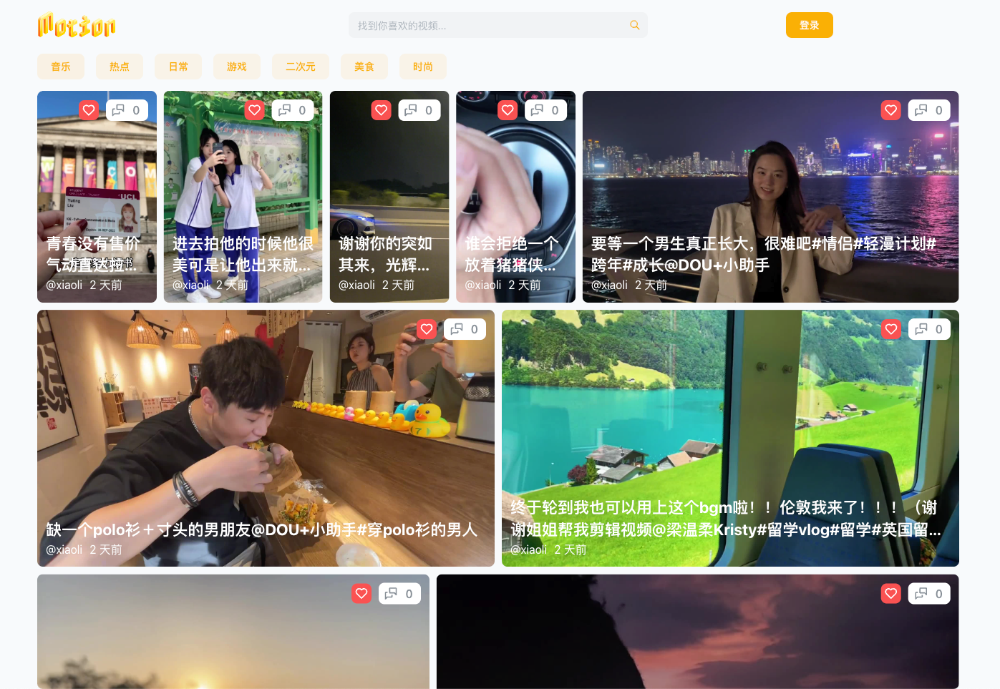

Motion 短视频 web后端

访问 https://nanfangshaonian.feishu.cn/file/VTfDbgp2goPulgxvIF0c31eUnnb 查看演示视频.
访问 http://159.75.156.115 查看演示应用.

### 创作意图：

建一个功能强大、高性能、安全可靠的短视频网站，使用户能够：

- 上传和分享短视频。
- 探索并且收藏喜欢的视频。
- 与其他用户进行互动,包括点赞,评论和分享。
- 个性化的视频推荐,提高用户粘性。
- 在个性化推荐的同时,保护用户数据和隐私确保合规且安全。

## Getting Started

前置要求：
本机安装了jdk8或更高版本
如何运行程序：

- 首先如果不使用本地的数据库的sql，直接启动dev环境就可以, 但是如果是想使用本地的sql 请使用sql文件夹的sql文件，导入到数据库并更改application.yaml 文件的配置
- 1·redis地址
- 2·mysql地址

## 技术框架：

​	后端技术包括：

​		Java，SpringSecurity，SpringBoot，SpringMVC，MyBatis-Plus，MySQL，Redis，

开发工具：IDEA，Navicat，Another Redis Desktop Manager

​	七牛云相关API和SDK：

​		七牛云对象存储，七牛云视频审核，七牛云文本

​	服务器与协议：

​		Nginx，HTTP

​	前端技术包括：Web，TanstackQuery，Next.js

​		开发工具：VSCode,Chrome

doc里面的motion.openapi.json是api接口json文档
api在线文档可以查看
https://apifox.com/apidoc/shared-d39ff628-63ff-46bb-a831-ed04e33fba62

